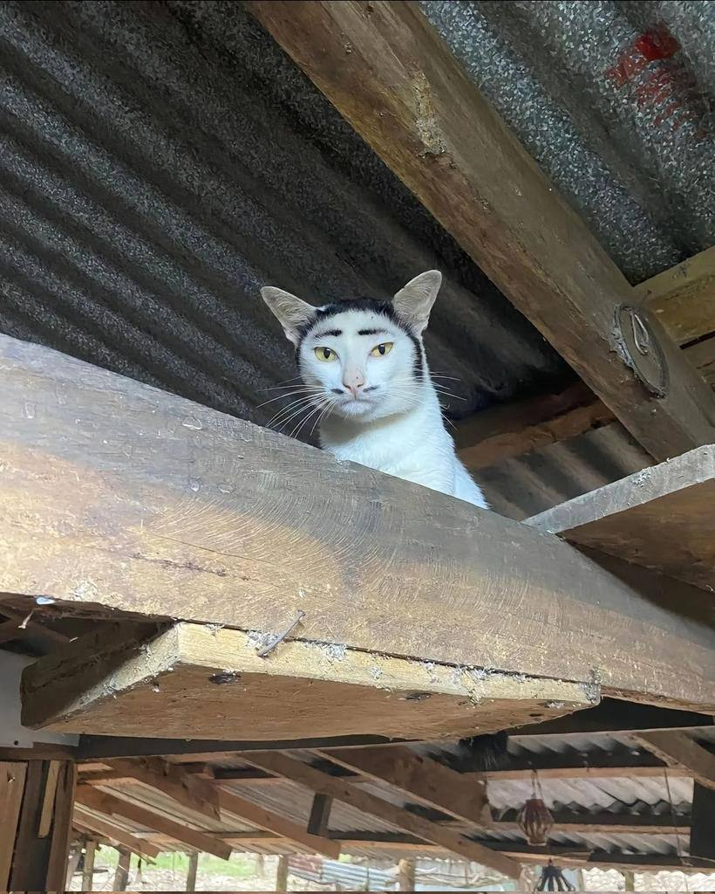
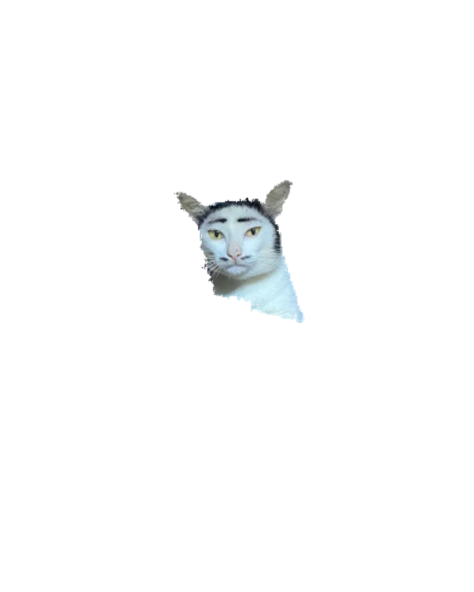

# Remove background

***Model accuracy is about 75%***
Image      | Background removed
:---------:|:---------:
  | 


Install tensorflow : 

``` pip install tensorflow numpy Pillow ```

Run `rm_back.py`

``` python rm_back.py ```
This produces an image with a black background,
It will infinitely ask for an image path, predict and save the output image to same path with `_back_removed` added to the ended of the image name.

To stop just use `ctrl + C`. 

# Limitations
Due to hardware, and connection limitations I am unable to train/develope the model on my machine, all the development was done on Google Collab as much as it allows before it yanks the GPU.

***The models are not well trained***
# Development 
The models where developed on Google Collab.

I'm using MobileNetV2 as base model for semantic image segmentation.

2 models are available that can detect objects somewhat accurately.
- cocoset_seg
- DUTS_set_model

Many versions of the models exists the best one is : `DUTS_set_model/DUTS_set_unet_semantic_segmentation_512_512_+4_epochs.keras`

A jupyter notebook for each model is available
In order to get started install requirements-model.txt, 

``` pip install -r requirements-model.txt```

then you can run all the commands in the notebook it will download and extract the dataset and start training the model.

## DUTS_set_model
this model is trained using the DUTS dataset, and resize images to 512x512, the quality is pretty much left intact.
## cocoset_seg

This is the model resize images to 128x128 hence the quality will be degraded.

It is trained using coco2017 dataset.

No class filters where used, all available classes where used for training and a binary mask was applied.

## oxf_pet_ds_mdl

Contains the first model it is trained on the oxford pet dataset, this was used for initial testing and for me to 
learn about semantic segmentation.